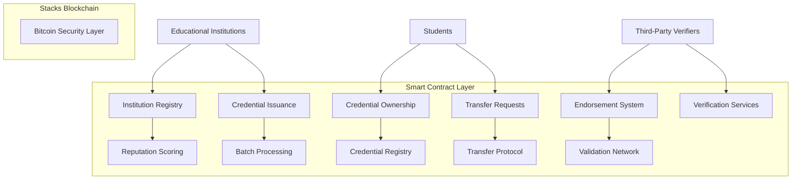
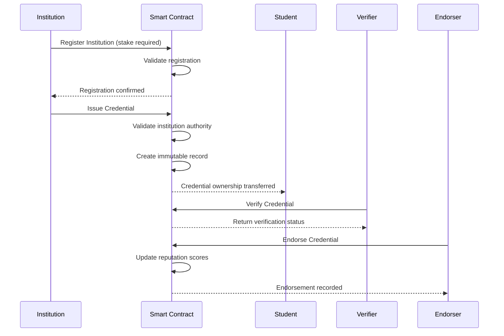

# EduChain - Universal Academic Verification Protocol


[](https://clarity-lang.org/)
[](https://www.stacks.co/)
[](https://bitcoin.org/)
[](LICENSE)

</div>

## 🎓 Overview

EduChain is a revolutionary blockchain-based infrastructure for creating tamper-proof academic records that transcend institutional boundaries. Built on the Stacks blockchain with Bitcoin's rock-solid security foundation, this protocol creates an immutable ledger of academic achievements that no single institution can control or manipulate.

### 🚀 Key Innovations

- **🔒 Trustless Verification** - Eliminates diploma mills and credential fraud through cryptographic proof
- **🤝 Cross-Institutional Endorsement** - Networks that strengthen credential value through peer validation
- **👥 Granular Permission Systems** - Secure delegation of authority with role-based access control
- **⚡ Automated Batch Processing** - Seamless institutional integration with bulk operations
- **📊 Dynamic Reputation Scoring** - Rewards quality educational providers with algorithmic reputation
- **🌍 Secure Transfer Protocols** - Enables credential portability across borders and institutions
- **⏰ Expiration Controls** - Ensures credentials remain current and relevant

## 🏗️ System Architecture

### Core Components



### Data Flow Architecture



## 📋 Contract Architecture

### Data Structures

#### Institution Registry

```clarity
{
  name: string-ascii 64,
  stake-amount: uint,
  credentials-issued: uint,
  reputation-score: uint,
  active: bool,
  suspension-status: bool,
  registration-date: uint,
  last-update: uint
}
```

#### Credential Registry

```clarity
{
  institution: principal,
  degree: string-ascii 64,
  year: uint,
  verified: bool,
  validation-level: uint,
  endorsements: uint,
  metadata-url: string-ascii 256,
  expiry-date: uint,
  revoked: bool,
  category: string-ascii 32,
  issue-date: uint,
  last-endorsed: uint
}
```

#### Endorsement System

```clarity
{
  timestamp: uint,
  weight: uint,
  comment: string-ascii 256,
  endorser-type: string-ascii 32
}
```

### Key Functions

#### Institution Management

- `register-institution` - Register as a credential-issuing institution
- `add-delegate` - Delegate authority to authorized personnel

#### Credential Operations

- `issue-credential` - Issue a new academic credential
- `batch-issue-credentials` - Process multiple credentials efficiently
- `endorse-credential-extended` - Add institutional endorsements

#### Transfer Protocol

- `request-credential-transfer` - Initiate credential ownership transfer
- `is-credential-valid` - Verify credential status and validity

## 🛠️ Development Setup

### Prerequisites

- [Clarinet](https://github.com/hirosystems/clarinet) - Stacks development toolkit
- [Node.js](https://nodejs.org/) (v16 or higher)
- [Git](https://git-scm.com/)

### Installation

1. **Clone the repository**

   ```bash
   git clone https://github.com/testimony-arike/edu-chain.git
   cd edu-chain
   ```

2. **Install dependencies**

   ```bash
   npm install
   ```

3. **Check contract syntax**

   ```bash
   clarinet check
   ```

### Project Structure

```
edu-chain/
├── contracts/
│   └── edu-chain.clar          # Main smart contract
├── tests/
│   └── edu-chain.test.ts       # Test suite
├── settings/
│   ├── Devnet.toml            # Development network config
│   ├── Testnet.toml           # Testnet configuration
│   └── Mainnet.toml           # Mainnet configuration
├── Clarinet.toml              # Project configuration
├── package.json               # Node.js dependencies
└── README.md                  # Project documentation
```

## 🧪 Testing

### Run Tests

```bash
# Run all tests
npm test

# Run tests with coverage report
npm run test:report

# Watch mode for development
npm run test:watch
```

### Test Coverage

The test suite covers:

- ✅ Institution registration and validation
- ✅ Credential issuance and batch operations
- ✅ Endorsement system functionality
- ✅ Transfer protocol mechanics
- ✅ Permission and delegation systems
- ✅ Error handling and edge cases

## 🔧 Configuration

### Network Settings

#### Development (Devnet)

- Fast block times for rapid testing
- Lower staking requirements
- Relaxed validation rules

#### Testnet

- Production-like environment
- Real STX tokens (testnet)
- Full validation suite

#### Mainnet

- Production deployment
- Full security measures
- Complete economic model

### Key Parameters

| Parameter | Value | Description |
|-----------|-------|-------------|
| `MINIMUM-STAKE` | 1,000,000 µSTX | Required stake for institution registration |
| `MAX-BATCH-SIZE` | 50 | Maximum credentials per batch operation |
| `ERR-*` | 100-120 | Error code range for various failure modes |

## 🔐 Security Features

### Cryptographic Security

- **Bitcoin-backed immutability** - Leverages Bitcoin's proof-of-work security
- **Stacks consensus** - Proof-of-Transfer mechanism for finality
- **Multi-signature support** - Institutional key management

### Access Control

- **Stake-based authorization** - Economic incentives for honest behavior
- **Role-based permissions** - Granular authority delegation
- **Time-bounded delegations** - Automatic expiry of delegated authority

### Data Integrity

- **Tamper-proof records** - Immutable credential storage
- **Cryptographic verification** - Mathematical proof of authenticity
- **Decentralized validation** - No single point of failure

## 🌐 Use Cases

### For Educational Institutions

- **Credential Issuance** - Digitally issue tamper-proof diplomas and certificates
- **Reputation Building** - Gain recognition through peer endorsements
- **Batch Processing** - Efficiently handle graduation ceremonies
- **Authority Delegation** - Securely delegate issuing rights to departments

### For Students

- **Credential Ownership** - True ownership of academic achievements
- **Global Portability** - Transfer credentials across institutions and borders
- **Instant Verification** - Provide immediate proof to employers
- **Lifetime Access** - Permanent record even if institution closes

### For Employers & Verifiers

- **Instant Verification** - Cryptographically verify credentials in real-time
- **Fraud Prevention** - Eliminate fake diplomas and credential mills
- **Cost Reduction** - Automate verification processes
- **Global Standards** - Universal verification protocol

### For Third-Party Endorsers

- **Quality Assurance** - Validate and endorse educational quality
- **Network Effects** - Build reputation through peer validation
- **Industry Standards** - Establish cross-institutional benchmarks

## 📊 Economic Model

### Staking Mechanism

- Institutions stake STX tokens to participate
- Economic incentives ensure honest behavior
- Slashing conditions for fraudulent activity

### Reputation System

- Dynamic scoring based on endorsements
- Weight-based validation from peers
- Algorithmic reputation calculation

### Fee Structure

- Transaction fees for credential operations
- Incentives for network validators
- Economic sustainability model

## 🛣️ Roadmap

### Phase 1: Core Protocol ✅

- [x] Basic credential issuance
- [x] Institution registration
- [x] Transfer mechanisms
- [x] Endorsement system

### Phase 2: Enhanced Features 🚧

- [ ] Advanced delegation permissions
- [ ] Batch processing optimizations
- [ ] Enhanced reputation algorithms
- [ ] Cross-chain bridges

### Phase 3: Ecosystem Expansion 📋

- [ ] API integrations
- [ ] Mobile applications
- [ ] Institutional partnerships
- [ ] Global adoption initiatives

## 🤝 Contributing

We welcome contributions to EduChain! Please read our [Contributing Guidelines](CONTRIBUTING.md) for details on:

- Code style and standards
- Pull request process
- Issue reporting
- Development workflow

### Development Workflow

1. Fork the repository
2. Create a feature branch
3. Make your changes
4. Add tests for new functionality
5. Ensure all tests pass
6. Submit a pull request

## 📜 License

This project is licensed under the ISC License - see the [LICENSE](LICENSE) file for details.
